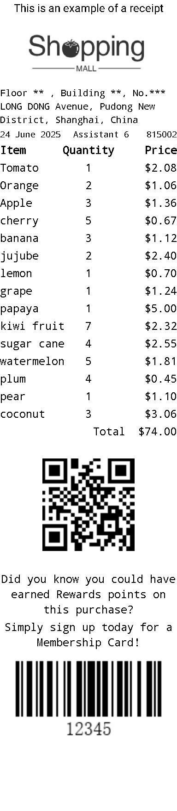

# POIPrinterManager


## 小票样例

<table style="width: 100%;">
    <tr>
        <td rowspan="30"></td>
        <td>文本</td>
        <td>addPrintLine(TextPrintLine)</td>
    </tr>
    <tr>
        <td>多列文本</td>
        <td>addPrintLine(List<> line)</td>
    </tr>
    <tr>
        <td>图片</td>
        <td>addPrintLine(BitmapPrintLine)</td>
    </tr>
    <tr>
        <td>对齐方式</td>
        <td>PrintLine.LEFT;.CENTER;.RIGHT</td>
    </tr>
    <tr>
        <td>字体大小</td>
        <td>TextPrintLine.setSize</td>
    </tr>
    <tr>
        <td>字体加粗</td>
        <td>TextPrintLine.setBold</td>
    </tr>
</table>

* 代码样例
```java{1-3,50,69}
final POIPrinterManager printerManager = new POIPrinterManager(context);
printerManager.open();
printerManager.cleanCache();

// Set gray proportion
printerManager.setPrintGray(printGray);
// Set red proportion
printerManager.setPrintRed(printRed);
// Set Line Height
printerManager.setLineSpace(5);
// Print text
String str1 = "This is an example of a receipt";
printerManager.addPrintLine(new TextPrintLine(str1, PrintLine.CENTER));
// Print picture
Bitmap bitmap = BitmapFactory.decodeResource(context.getResources(), R.drawable.shopping_mall);
printerManager.addPrintLine(new BitmapPrintLine(bitmap, PrintLine.CENTER));
// Set font family
printerManager.setPrintFont("/system/fonts/DroidSansMono.ttf");

String str2 = "Floor ** , Building **, No.*** LONG DONG Avenue, Pudong New District, Shanghai, China";
// Set text size
PrintLine p2 = new TextPrintLine(str2, PrintLine.LEFT, 20);
printerManager.addPrintLine(p2);
List<TextPrintLine> list1 = printList("24 June 2025", "     Assistant 6", "815002", 18, false);
printerManager.addPrintLine(list1);
List<TextPrintLine> list2 = printList("Item", "Quantity", "Price", 24, true);
printerManager.addPrintLine(list2);
List<TextPrintLine> list3 = printList("Tomato", "1", "$2.08", 24, false);
printerManager.addPrintLine(list3);
List<TextPrintLine> list4 = printList("Orange", "2", "$1.06", 24, false);
printerManager.addPrintLine(list4);
// ...

PrintLine p3 = new TextPrintLine("Total  $74.00", PrintLine.RIGHT);
printerManager.addPrintLine(p3);
printerManager.addPrintLine(new TextPrintLine(""));

// drawable/barcode.jpg  100*100
bitmap = BitmapFactory.decodeResource(context.getResources(), R.drawable.barcode);
printerManager.addPrintLine(new BitmapPrintLine(bitmap, PrintLine.CENTER));
printerManager.addPrintLine(new TextPrintLine(""));
String str3 = "Did you know you could have earned Rewards points on this purchase?";
PrintLine p4 = new TextPrintLine(str3, PrintLine.CENTER);
printerManager.addPrintLine(p4);
PrintLine p5 = new TextPrintLine("Simply sign up today for a Membership Card!", PrintLine.CENTER);
printerManager.addPrintLine(p5);
bitmap = BitmapFactory.decodeResource(context.getResources(), R.drawable.barcode_12345);
printerManager.addPrintLine(new BitmapPrintLine(bitmap, PrintLine.CENTER));
printerManager.addPrintLine(new TextPrintLine(" ", 0, 100));
POIPrinterManager.IPrinterListener listener = new POIPrinterManager.IPrinterListener() {
    @Override
    public void onStart() {
        Log.i(TAG, "onStart");
    }

    @Override
    public void onFinish() {
        Log.i(TAG, "onFinish");
        printerManager.close();
    }

    @Override
    public void onError(int code, String msg) {
        Log.e(TAG, "onError code: " + code + ", msg: " + msg);
        if (dialog == null || !dialog.isShowing())
            showAlertDialog(printerManager, code, msg);
    }
};
printerManager.beginPrint(listener);

```
